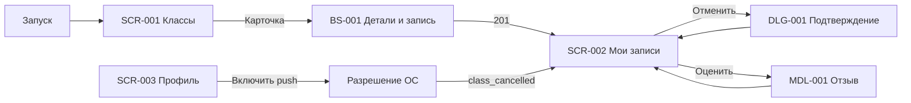

# Реестр экранов и дизайн-брифов

Документы задают требования дизайнеру: назначение, иерархию, состояния, поведение и ограничения. Это не техническое ТЗ и не описание текущего JSX. Визуальный baseline — существующий Expo UI согласно D-008; расхождения с требованиями помечаются как целевое состояние.

**Платформы:** Android и iOS; web — демонстрационный preview. **Роль:** только клиент. **Зона:** авторизованная через dev-auth.

## Реестр

| ID | Название | Тип | Приоритет | Вход | Основной выход | Документ |
|---|---|---|---|---|---|---|
| SCR-001 | Классы / расписание | Верхнеуровневый экран | Critical | Запуск, таб «Классы» | BS-001 | [SCR-001-class-schedule.md](SCR-001-class-schedule.md) |
| SCR-002 | Мои записи | Верхнеуровневый экран | Critical | Таб, успешная бронь, push | DLG-001, MDL-001 | [SCR-002-my-bookings.md](SCR-002-my-bookings.md) |
| SCR-003 | Профиль | Верхнеуровневый экран | High | Таб «Профиль» | Системный запрос push | [SCR-003-profile.md](SCR-003-profile.md) |
| BS-001 | Детали класса и запись | Bottom sheet | Critical | Карточка CMP-001 | SCR-002 при успехе | [BS-001-class-booking.md](BS-001-class-booking.md) |
| MDL-001 | Оценка шефа | Центрированный modal | Medium | Действие в CMP-002 | SCR-002 | [MDL-001-chef-review.md](MDL-001-chef-review.md) |
| DLG-001 | Подтверждение отмены | Системный dialog | High | Действие в CMP-002 | SCR-002 | [DLG-001-cancel-confirm.md](DLG-001-cancel-confirm.md) |
| CMP-001 | Карточка класса | Компонент SCR-001 | Critical | Контент расписания | BS-001 | [SCR-001 § CMP-001](SCR-001-class-schedule.md#cmp-001--карточка-класса) |
| CMP-002 | Карточка брони | Компонент SCR-002 | Critical | Контент записей | DLG-001 или MDL-001 | [SCR-002 § CMP-002](SCR-002-my-bookings.md#cmp-002--карточка-брони) |

## Сквозные пользовательские пути

## Общие зависимости

- [Foundations](00-foundations.md) обязательны для всех артефактов.
- Источники поведения: `functional-requirements.md`, `non-functional-requirements.md`, `user-stories.md`, `use-cases.md`.
- Каталог, классы и шефы — read-only; клиент изменяет только брони, отзывы и push-токен.
- Детальный API и программная реализация не задаются дизайн-брифом.

## Мобильное ТЗ

Техническая детализация всех реестровых экранов и слоёв находится в [`../05-mobile-app-spec/README.md`](../05-mobile-app-spec/README.md). UI-ID одинаковы в дизайн-брифах и мобильном ТЗ; переиспользуемые алгоритмы имеют отдельные `LOGIC-*`.

## Не входит

Production-auth, админка, интерфейс шефа, редактирование профиля/аллергий, онлайн-оплата, лояльность и reminder-push. Строки «Аллергии и предпочтения» и «Помощь» в текущем UI считаются неактивными placeholder-элементами до появления требований.
