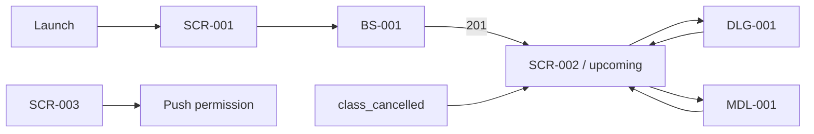

# Мобильное ТЗ «Шеф-стол»

Техническое задание описывает целевое поведение Expo-клиента по согласованным требованиям, дизайн-брифам и OpenAPI 1.2. Это источник для реализации и тест-дизайна, но не утверждение, что текущее приложение уже соответствует каждому пункту.

**Платформы:** Android, iOS; web — demo-preview. **Роль:** seeded demo-клиент. **API:** `docs/02-design/openapi.yaml`.

## Документы интерфейса

| ID | Артефакт | Приоритет | Спецификация | Дизайн-бриф |
|---|---|---|---|---|
| SCR-001 | Классы / расписание | Critical | [SCR-001-class-schedule.md](SCR-001-class-schedule.md) | [Design](../03-design-brief/SCR-001-class-schedule.md) |
| SCR-002 | Мои записи | Critical | [SCR-002-my-bookings.md](SCR-002-my-bookings.md) | [Design](../03-design-brief/SCR-002-my-bookings.md) |
| SCR-003 | Профиль | High | [SCR-003-profile.md](SCR-003-profile.md) | [Design](../03-design-brief/SCR-003-profile.md) |
| BS-001 | Детали класса и запись | Critical | [BS-001-class-booking.md](BS-001-class-booking.md) | [Design](../03-design-brief/BS-001-class-booking.md) |
| MDL-001 | Оценка шефа | Medium | [MDL-001-chef-review.md](MDL-001-chef-review.md) | [Design](../03-design-brief/MDL-001-chef-review.md) |
| DLG-001 | Подтверждение отмены | High | [DLG-001-cancel-confirm.md](DLG-001-cancel-confirm.md) | [Design](../03-design-brief/DLG-001-cancel-confirm.md) |

CMP-001 и CMP-002 специфицированы внутри экранов-владельцев SCR-001 и SCR-002.

## Общие соглашения

- `Loading` — первичная загрузка без данных; `Refreshing` — обновление поверх сохранённого Content.
- Первичная ошибка показывает постоянный Error state с retry; refresh-ошибка не удаляет подтверждённые данные.
- Mutation success фиксируется отдельно от последующего refresh failure.
- UI не принимает решение об остатках и допустимости мутации вместо backend.
- Все защищённые запросы содержат `Authorization: Bearer <dev-token>`.
- Пользователю показывается понятный текст, а не HTTP status/machine code.
- Денежные значения приходят в копейках; даты — ISO 8601 с offset.

## Навигация

Системный Back закрывает верхний слой до смены таба. Нижняя навигация видна только на SCR-001–SCR-003.

## Используемые операции API

| operationId | Метод и путь | Используется |
|---|---|---|
| `listClasses` | `GET /classes` | SCR-001, refresh после конфликта |
| `getClass` | `GET /classes/{classId}` | Восстановление класса для исторической брони/актуализация BS-001 |
| `listBookings` | `GET /bookings` | SCR-002, push refresh, общий refresh |
| `createBooking` | `POST /bookings` | BS-001 |
| `cancelBooking` | `POST /bookings/{bookingId}/cancel` | DLG-001 / SCR-002 |
| `createReview` | `POST /bookings/{bookingId}/review` | MDL-001 |
| `registerPushToken` | `POST /push-tokens` | SCR-003 |

## Переиспользуемые логики

Индекс и точки применения: [logic/README.md](logic/README.md). Экранный документ ссылается на логику вместо копирования алгоритма.

## Граница текущей реализации

Текущий `client/App.tsx` — визуальный baseline. Известные расхождения (стабильный idempotency retry, полноценный Error state, refresh после conflict, nullable DTO, auth wiring и строгая push-валидация) остаются открытыми в `docs/lecture-gap-checklists.md` и устраняются на этапе разработки.
