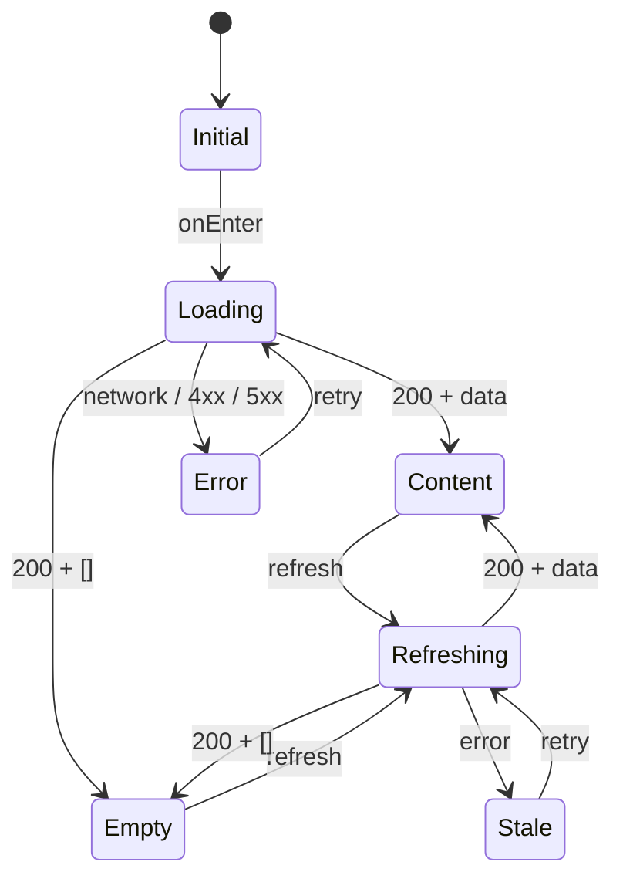

# LOGIC-007 · Состояния, refresh и ошибки API

**Приоритет:** Critical · **Точки:** все сетевые экраны и mutations · **Требования:** FR-004, NFR-005, NFR-008.

## State machine чтения

`Stale` отображает последний успешный Content/Empty плюс сообщение. Первичная ошибка никогда не маскируется Empty state.

## Mutation state

`idle → submitting → succeeded | failed | unknown`. На `submitting` затронутый CTA disabled. `succeeded` применяется из ответа mutation до refresh. `unknown` используется для неоднозначного сетевого результата и обрабатывается предметной логикой, особенно LOGIC-003.

## Error mapping

| Класс | UI |
|---|---|
| `400/422` | Понятный общий текст; `fieldErrors` — inline у соответствующих полей |
| `401` | Ошибка demo-auth; не выдавать её за network error |
| `404` | Контекстное «не найдено», затем безопасный refresh |
| `409/410` | Machine code передаётся предметной LOGIC, generic fallback только для неизвестного кода |
| `429` | Уважать `Retry-After`, не создавать request storm |
| `500/503/network` | Сохранить данные/ввод, дать retry; технические детали скрыты |

Problem должен содержать `status`, `code`, `message`; `traceId` можно включить в диагностический отчёт, но не использовать как основной пользовательский текст. Аллергии и Bearer-токен не логируются.

## Совместное обновление

Расписание и брони имеют независимые состояния: сбой одного запроса не обнуляет успешный результат другого. `Promise.all` не должен превращать частичный успех в полную потерю экрана.

## Критерии

- При первичном 5xx виден Error + retry, а не Empty.
- При refresh 5xx старые подтверждённые брони остаются.
- Успешная mutation с неуспешным refresh остаётся успешной и помечает данные устаревшими.

