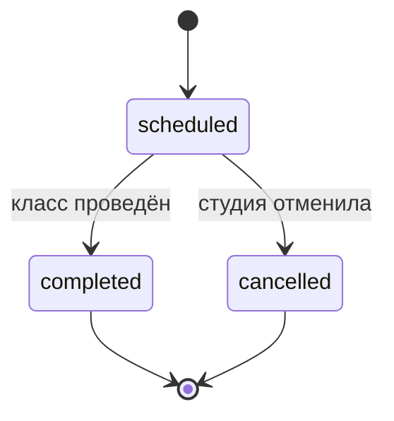
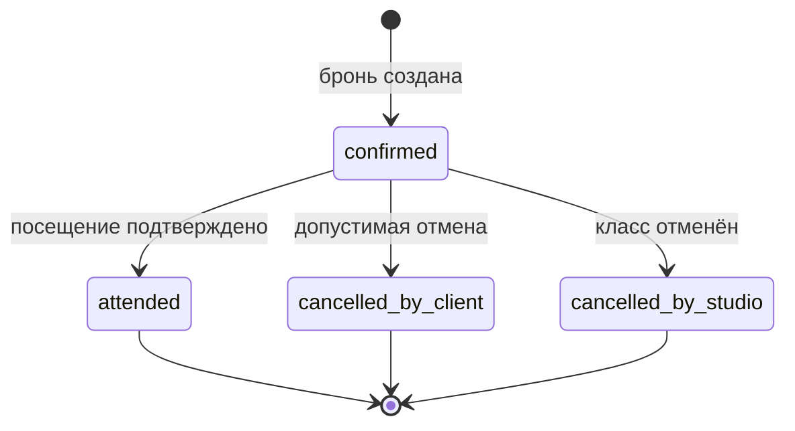

# Описание домена «Кулинарная студия»

## Назначение и границы

«Шеф-стол» помогает клиенту самостоятельно выбрать кулинарный класс, забронировать одно место, управлять записью и оставить отзыв после посещения. Цель MVP — уменьшить ручную запись через мессенджеры и исключить подтверждение недоступного места.

В продуктовую границу входят клиентское Expo-приложение, референсный FastAPI-backend и PostgreSQL. Управление расписанием, интерфейсы шефа/администратора и production-инфраструктура остаются внешними. Основание расширения поставки — `decisions/ADR-001-own-backend.md`.

## Акторы и внешние системы

| Участник | Роль в домене |
|---|---|
| Клиент | Просматривает классы, создаёт и отменяет свою бронь, включает push, отправляет отзыв |
| Студия/администратор | Внешняя роль: формирует расписание, меняет статус класса, отмечает посещение |
| Шеф | Ведёт класс; в MVP является read-only частью каталога |
| Client app | Показывает состояние и отправляет команды, но не гарантирует остатки |
| FastAPI backend | Авторизует demo-клиента, применяет бизнес-правила и управляет транзакциями |
| PostgreSQL | Хранит состояние и обеспечивает ограничения/блокировки |
| APNs/FCM | Внешний канал production-push; его серверная настройка вне MVP |

## Основные понятия

| Понятие | Определение |
|---|---|
| Программа | Описание формата класса: название, уровень, меню и длительность |
| Кулинарный класс | Проведение программы конкретным шефом в определённое время и по адресу |
| Место | Единица доступной вместимости класса; одна бронь MVP занимает одно место |
| Прокатный набор | Ограниченный комплект фартука/инвентаря с фиксированной доплатой |
| Бронь | Связь клиента и класса с выбранным набором, аллергиями, ценой и статусом |
| Дедлайн отмены | Момент за 12 часов до начала, после которого онлайн-отмена запрещена |
| Отмена студией | Завершение класса организатором с обязательной причиной и уведомлением клиентов |
| Отзыв | Одноразовая оценка 1–5 и необязательный комментарий после посещения |
| Ключ идемпотентности | UUID, связывающий безопасные повторы одного запроса создания брони |

## Сущности и владение

| Сущность | Владелец изменения | Клиент читает | Клиент инициирует изменение |
|---|---|---:|---:|
| Client | auth/profile infrastructure | Да | Только идентификация demo-клиента в MVP |
| Chef | студия | Да | Нет |
| Program | студия | Да | Нет |
| CookingClass | студия | Да | Нет |
| Booking | backend клиентского API | Да | Создание и допустимая отмена |
| Review | backend клиентского API | Да | Однократное создание |
| PushToken | backend клиентского API | Косвенно | Регистрация/обновление |
| IdempotencyRecord | backend | Нет | Создаётся из заголовка запроса |

## Жизненные циклы

## Бизнес-правила домена

| ID | Правило |
|---|---|
| BRULE-001 | Клиентское приложение не создаёт и не редактирует программы, шефов и расписание. |
| BRULE-002 | По умолчанию выдаются 7 дней; допустимые расширения — 14 и 30 дней. |
| BRULE-003 | Одна бронь MVP занимает ровно одно место. |
| BRULE-004 | Итоговая цена равна цене класса плюс тариф проката, если выбран rental; деньги хранятся в копейках. |
| BRULE-005 | Аллергии содержат не более 300 Unicode code points и не должны попадать в технические логи. |
| BRULE-006 | У клиента не может быть двух активных броней одного класса. |
| BRULE-007 | Backend атомарно проверяет статус класса и остаток мест перед созданием брони. |
| BRULE-008 | Rental разрешён только при положительном остатке; подтверждение уменьшает остаток ровно на один. |
| BRULE-009 | Повтор запроса с тем же `Idempotency-Key` и payload возвращает прежний результат; иной payload с тем же ключом отклоняется. В MVP результат хранится до сброса БД. |
| BRULE-010 | Клиентская отмена разрешена до дедлайна включительно: `startsAt - 12h`. |
| BRULE-011 | Успешная клиентская отмена возвращает место и арендованный набор ровно один раз. |
| BRULE-012 | Отмена студией сохраняет бронь в истории, требует причину и запрещает новую запись на класс. |
| BRULE-013 | Отзыв разрешён только для `attended`, один раз, с целой оценкой 1–5 и комментарием до 500 Unicode code points. |
| BRULE-014 | Все даты и дедлайны интерпретируются в `Europe/Moscow`, наружу передаются ISO 8601 с offset. |
| BRULE-015 | `SLOT_CANCELLED` возвращается как 410; конфликты места, проката и повторной брони — как 409. |
| BRULE-016 | Разрешение push запрашивается только после явного действия клиента. |

## Основные доменные процессы

1. **Просмотр расписания:** клиент задаёт период/уровень, backend возвращает read-only классы, UI различает loading/content/empty/error.
2. **Создание брони:** клиент выбирает класс и инвентарь, передаёт аллергии и ключ идемпотентности; backend в одной транзакции проверяет инварианты и создаёт бронь.
3. **Отмена клиентом:** backend проверяет владельца, статус и дедлайн, затем атомарно меняет статус и возвращает остатки.
4. **Отмена студией:** внешняя студийная логика отменяет класс и связанные брони; клиент получает событие и перечитывает историю.
5. **Отзыв:** после статуса `attended` клиент один раз отправляет оценку и комментарий.

## Доменные события

| Событие | Когда возникает | Наблюдаемый результат |
|---|---|---|
| BookingCreated | Транзакция бронирования подтверждена | Бронь в предстоящих, остатки уменьшены |
| BookingCancelledByClient | Допустимая отмена подтверждена | Бронь в истории, остатки возвращены |
| ClassCancelled | Студия отменила класс | Брони `cancelled_by_studio`, сохранена причина, отправляется push |
| BookingAttended | Внешняя система отметила посещение | Бронь в истории, становится доступен отзыв |
| ReviewSubmitted | Валидный отзыв сохранён | Повторная отправка запрещена |
| PushTokenRegistered | Клиент дал разрешение и передал токен | Backend может адресовать отмену устройству |

## Границы ответственности

- UI отвечает за ввод, навигацию и понятное отображение, но не за конкурентные гарантии.
- Backend отвечает за авторизацию запроса, валидацию, правила и транзакции.
- PostgreSQL обеспечивает уникальность, ссылочную целостность и блокировки.
- Внешняя студийная часть отвечает за каталог, расписание, отмену класса и отметку посещения.
- Push-провайдер отвечает за доставку, но приложение обязано корректно обработать foreground/open/cold start.

## Незакрытые production-вопросы

Production-auth, юридическая обработка аллергий, поздние штрафы, reminder-push, глубина истории, SLA и мониторинг перечислены как `OQ-001`–`OQ-008` в `customer-questions.md`. Они не блокируют учебный MVP и не должны реализовываться по догадке.
