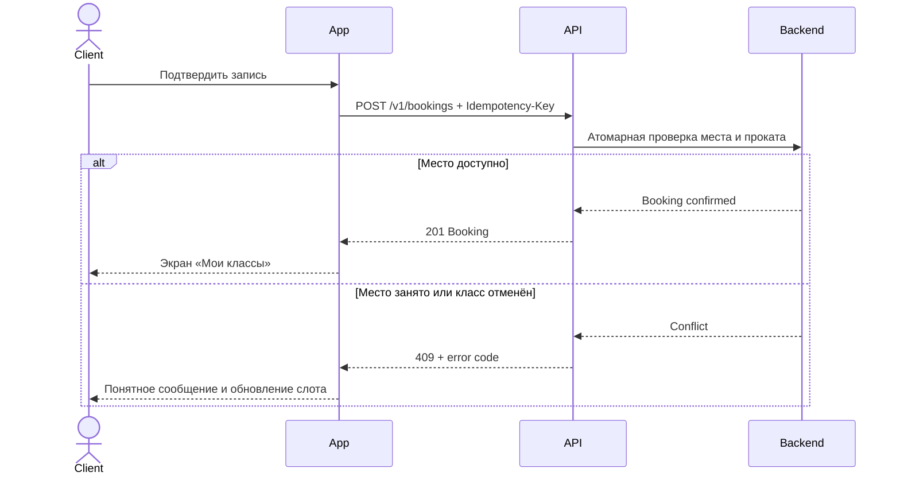
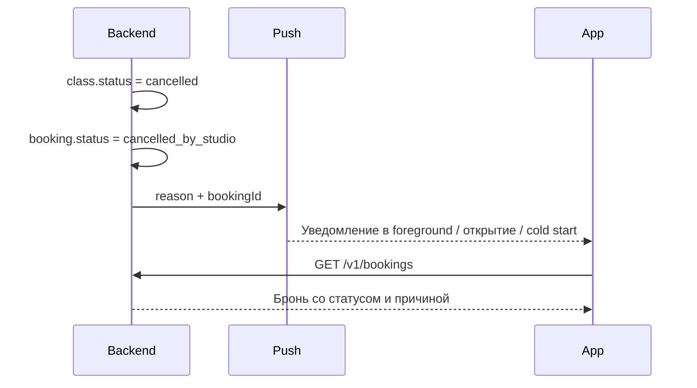

# API-последовательности

## Бронирование

```mermaid
sequenceDiagram
    actor Client
    participant App
    participant API
    participant Backend
    Client->>App: Подтвердить запись
    App->>API: POST /v1/bookings + Idempotency-Key
    API->>Backend: Атомарная проверка места и проката
    alt Место доступно
      Backend-->>API: Booking confirmed
      API-->>App: 201 Booking
      App-->>Client: Экран «Мои классы»
    else Место занято или класс отменён
      Backend-->>API: Conflict
      API-->>App: 409 + error code
      App-->>Client: Понятное сообщение и обновление слота
    end
```

## Отмена студией

```mermaid
sequenceDiagram
    participant Backend
    participant Push
    participant App
    Backend->>Backend: class.status = cancelled
    Backend->>Backend: booking.status = cancelled_by_studio
    Backend->>Push: reason + bookingId
    Push-->>App: Уведомление в foreground / открытие / cold start
    App->>Backend: GET /v1/bookings
    Backend-->>App: Бронь со статусом и причиной
```

