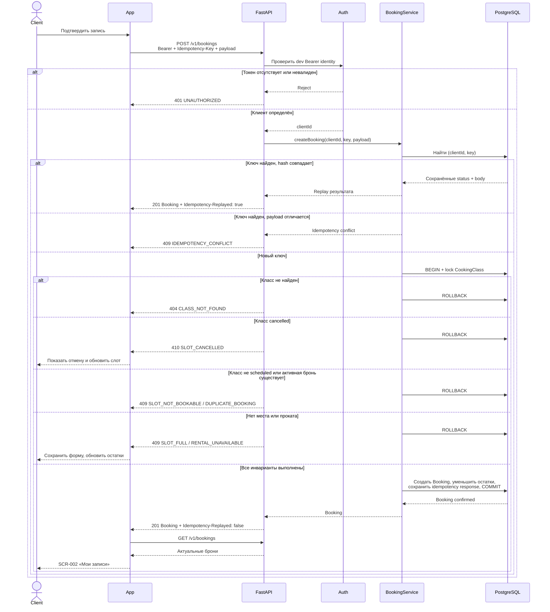

# API-последовательности

## Создание брони

`Idempotency-Key` создаётся один раз на логическую попытку и сохраняется клиентом для сетевого retry. Сервер является единственным источником решения об остатках.



Unique/CHECK constraints остаются последней линией защиты при гонке. Их нарушение маппится в тот же предметный `409`, а не в необработанный `500`.

## Отмена студией и push

Действие студии приходит из внешней управляющей системы и не является endpoint клиентского API.

```mermaid
sequenceDiagram
    participant Studio as Внешняя система студии
    participant Backend
    participant DB as PostgreSQL
    participant Push as APNs/FCM
    participant App

    Studio->>Backend: Отменить class + reason
    Backend->>DB: BEGIN; class=cancelled;<br/>confirmed bookings=cancelled_by_studio + reason
    DB-->>Backend: COMMIT
    Backend->>Push: class_cancelled {bookingId, reason}
    Push-->>App: Foreground / tap / cold start
    App->>App: Проверить type, bookingId, reason
    alt Payload валиден
        App->>Backend: GET /v1/bookings + Bearer
        Backend-->>App: Booking status + reason
        App-->>App: Открыть SCR-002 / История<br/>и очистить cold-start response
    else Payload malformed
        App->>App: Игнорировать событие, не менять данные
    end
```
