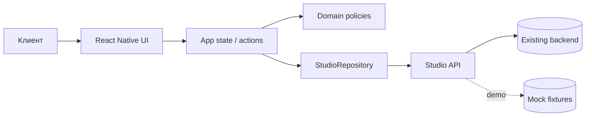

# Архитектурный план

## Контекст

Клиентское приложение «Шеф-стол» работает на Android, iOS и в web-режиме для демонстрации. Production-backend существует вне проекта. В репозитории используется `MockStudioApi`, реализующий тот же контракт асинхронными методами.

## Слои

| Слой | Ответственность | Примеры |
|---|---|---|
| UI | Экраны, формы, состояния загрузки/ошибки | Schedule, Booking sheet, My classes |
| Application | Состояние приложения и пользовательские действия | загрузка слотов, бронирование, отмена |
| Domain | Чистые типы и бизнес-правила | цена, дедлайн отмены, фильтрация |
| Data | Реализация API и преобразование DTO | `MockStudioApi` |

Зависимости направлены внутрь: UI использует domain и интерфейс API; domain не зависит от React Native.

## Состояния интерфейса

- `loading` — начальная загрузка и мутации;
- `ready` — данные доступны;
- `empty` — фильтр не нашёл классы;
- `error` — API вернул ошибку, доступен повтор;
- локальные модальные состояния не изменяют данные до подтверждения API.

## Обработка конкурентного бронирования

1. UI показывает последнее известное число мест.
2. При подтверждении отправляется `POST /bookings` с `Idempotency-Key`.
3. Backend повторно проверяет остаток атомарно.
4. При `409` клиент показывает предметную причину и обновляет расписание.
5. Клиентская проверка используется только для UX и не считается гарантией.

## Решения для MVP

- Expo + React Native + TypeScript: единая кодовая база и web-preview.
- Один экран-контейнер без внешнего навигатора: меньше инфраструктуры, три явных раздела.
- Чистые domain-функции тестируются без рендера UI.
- Деньги хранятся в копейках.
- Время хранится строкой ISO 8601; форматирование выполняется на границе UI.

## Production-доработки

- заменить `MockStudioApi` на HTTP-адаптер;
- добавить безопасное хранилище токена;
- подключить мониторинг ошибок и аналитику без PII;
- добавить offline-cache с политикой протухания;
- подключить push provider и deep links.

