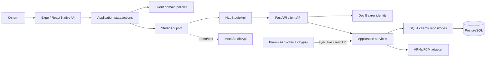

# Архитектурный план

## Контекст и статус

Клиент «Шеф-стол» работает на Android/iOS и в web-preview. По ADR-001 проект расширен референсным FastAPI-backend и PostgreSQL, воспроизводящими контракт существующей инфраструктуры. Управляющие интерфейсы студии остаются внешними; клиент не меняет каталог и расписание.

Expo-клиент расположен в `client/`. В `backend/` создан слоистый FastAPI-каркас и служебный health endpoint; доменные endpoint, PostgreSQL и корневой Docker Compose ещё не реализованы. `MockStudioApi` сохраняется только как demo/test fallback.

## Слои

| Слой | Ответственность | Примеры |
|---|---|---|
| UI | Экраны, формы, состояния загрузки/ошибки | Schedule, Booking sheet, My classes |
| Application | Состояние приложения и пользовательские действия | загрузка слотов, бронирование, отмена |
| Domain | Чистые типы и бизнес-правила | цена, дедлайн отмены, фильтрация |
| Data | Реализация API и преобразование DTO | `HttpStudioApi`, `MockStudioApi` |

Backend использует слои `api` → `services` → `domain` → `repositories/db`; FastAPI handlers валидируют HTTP и делегируют транзакционную логику сервисам. Composition root находится в `backend/app/main.py`.

Зависимости направлены внутрь: UI использует domain и интерфейс API; domain не зависит от React Native.

## Состояния интерфейса

- `loading` — начальная загрузка и мутации;
- `ready` — данные доступны;
- `empty` — фильтр не нашёл классы;
- `error` — API вернул ошибку, доступен повтор;
- локальные модальные состояния не изменяют данные до подтверждения API.

## Обработка конкурентного бронирования

1. UI показывает последнее известное число мест.
2. При подтверждении отправляется `POST /bookings` с `Idempotency-Key`.
3. Backend повторно проверяет остаток атомарно.
4. `409` используется для конфликтов остатка, проката, повторной брони и ключа идемпотентности; `410 SLOT_CANCELLED` — отдельно.
5. При предметном конфликте клиент сохраняет безопасный ввод, обновляет данные и не показывает ложный успех.
6. Клиентская проверка используется только для UX и не считается гарантией.

## Решения для MVP

- Expo + React Native + TypeScript: единая кодовая база и web-preview.
- `HttpStudioApi` реализует OpenAPI-контракт; mock остаётся автономным demo fallback.
- `docs/02-design/openapi.yaml` — источник истины; схема FastAPI проверяется на совместимость в CI.
- Все endpoint клиентского API используют Bearer identity seeded demo-клиента; client ID не передаётся в body.
- PostgreSQL, row locks, partial unique index и `IdempotencyRecord` обеспечивают конкурентную целостность.
- Expo Notifications получает APNs/FCM-токен по явному согласию, регистрирует его в API и обновляет брони по `class_cancelled` при foreground-доставке, открытии уведомления и холодном запуске.
- Один экран-контейнер без внешнего навигатора: меньше инфраструктуры, три явных раздела.
- Чистые domain-функции тестируются без рендера UI.
- Деньги хранятся в копейках.
- Время хранится строкой ISO 8601; форматирование выполняется на границе UI.

## Production-доработки

- добавить безопасное хранилище токена;
- подключить мониторинг ошибок и аналитику без PII;
- добавить offline-cache с политикой протухания;
- настроить production-ключи APNs/FCM у существующего backend и deep links.

## Границы текущей реализации

До этапа разработки остаются известные разрывы: клиент создаёт новый `Idempotency-Key` внутри каждого вызова вместо хранения на логическую попытку, не обновляет слот после всех конфликтов, валидирует push только по `type`, а OpenAPI ещё не проверяется CI. Они перечислены в `docs/lecture-gap-checklists.md` и не считаются реализованными только из-за появления целевого дизайна.
