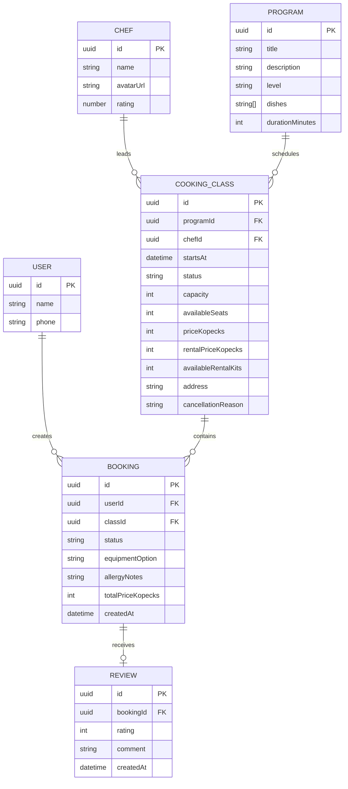

# Модель данных

## Инварианты

- `availableSeats` находится в диапазоне от 0 до `capacity`.
- `availableRentalKits` находится в диапазоне от 0 до `capacity` и уменьшается только после подтверждения проката.
- Активная бронь уникальна по `(userId, classId)`.
- `totalPriceKopecks = priceKopecks + rentalPriceKopecks`, если выбран прокат.
- `allergyNotes` содержит не более 300 символов.
- `review.rating` — целое число от 1 до 5.
- Отзыв уникален по `bookingId`.
- Отменённый класс не может принимать новые брони.

Модель описывает контракт, а не внутреннюю схему существующего backend.

